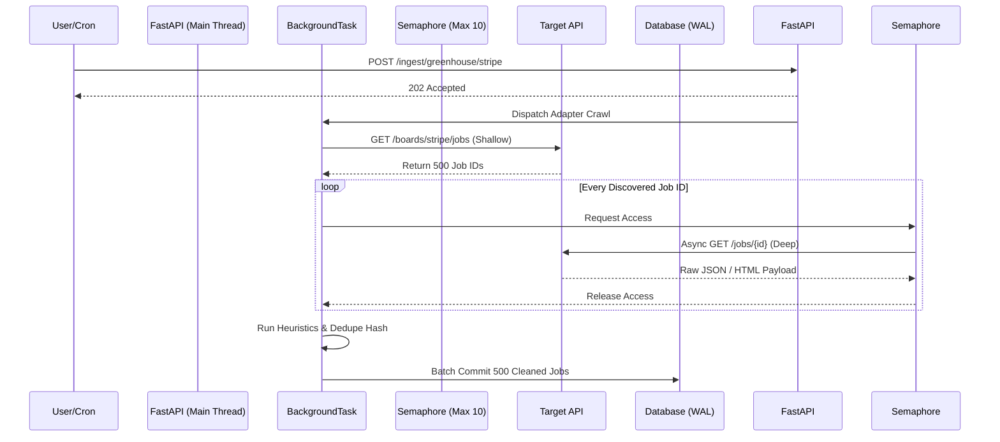

# Distributed Async Web Scraper & Intelligence Engine


A high-concurrency data ingestion and aggregation pipeline built for backend scale. This project demonstrates an asynchronous web scraping architecture designed to discover, fetch, normalize, and deduplicate unstructured REST API data at high velocity.

## 🚀 Technical Architecture
- **Backend Core**: FastAPI (Python 3.12+)
- **Concurrency Model**: `asyncio`, `httpx` with Semaphore-controlled connection pooling
- **Data Persistence**: SQLite optimized with Write-Ahead Logging (WAL) for non-blocking concurrent writes (modularly designed for easy swap to MongoDB).
- **Frontend Panel**: React (Vite) + Tailwind CSS v4 for data visualization and query monitoring.

### 🏗️ System Flow Diagram


## ⚙️ Key Backend Features

### 1. High-Concurrency Fetching (`httpx`)
Uses asynchronous HTTP requests to fetch thousands of JSON payloads concurrently. Implements `asyncio.Semaphore` to gracefully handle target API rate-limits and prevent connection pool starvation during massive crawl bursts.

### 2. Native Background Processing
Bypasses the need for heavy message brokers (like Celery/Redis) by leveraging native FastAPI `BackgroundTasks`. The main API thread remains fully unblocked and responsive (sub-10ms query times) while ingestion pipelines run asynchronously in the background.

### 3. Intelligent Deduplication Engine
- **Canonical URL Normalization**: Strips variable tracking parameters to prevent data duplication.
- **Content Hashing & Jaccard Similarity**: Generates SHA-256 hashes of payloads to identify identical entities cross-posted across different endpoints.

### 4. Search & Query Optimization
The REST API supports deep JSON querying, utilizing SQLAlchemy's string-casting to perform native text searches against unstructured payload data (e.g., searching for tech stacks like "NodeJS" buried inside nested JSON blobs).

## 📂 Project Structure
- `/backend` - The FastAPI application, concurrent scrapers (`adapters`), database config, and models.
- `/frontend` - A React visualization dashboard to monitor the scraped data.

## 🛠️ Quick Start

**1. Start the Backend API**
```bash
cd backend
python -m venv venv
source venv/bin/activate
pip install -r requirements.txt
uvicorn app.main:app --host 127.0.0.1 --port 8000
```

**2. Start the React Frontend**
```bash
cd frontend
npm install
npm run dev
```
